# Database Schema — Entity Relationship Diagram

> Auto-generated from 36 migration files (001–036) + base schema.
> **41 tables** across 11 domains. Last updated: 2026-04-04.

## Full ERD

```mermaid
erDiagram
    %% =====================================================================
    %% DOMAIN: User Management
    %% =====================================================================
    users {
        UUID user_id PK
        TEXT email UK
        TEXT password_hash
        TEXT name
        user_role role "student | instructor | admin | ta"
        TEXT course_id
        TEXT group_id
        TIMESTAMPTZ created_at
    }

    user_enrollments {
        UUID enrollment_id PK
        UUID user_id FK
        TEXT course_id
        TEXT group_id
        user_role role
        BOOLEAN is_primary
        TIMESTAMPTZ enrolled_at
    }

    user_preferences {
        UUID user_id PK,FK
        TEXT theme "light | dark"
        TEXT font_size "small | medium | large"
        BOOLEAN high_contrast
        JSONB preferences
        TIMESTAMPTZ updated_at
    }

    reviewer_reputation {
        UUID user_id PK,FK
        NUMERIC helpfulness_score
        NUMERIC consistency_score
        INT total_reviews
        INT helpful_votes
        INT total_votes
        TIMESTAMPTZ updated_at
    }

    %% =====================================================================
    %% DOMAIN: Course & Semester Management
    %% =====================================================================
    semesters {
        UUID semester_id PK
        TEXT name
        DATE start_date
        DATE end_date
        BOOLEAN is_active
        TIMESTAMPTZ created_at
    }

    announcements {
        UUID announcement_id PK
        TEXT course_id
        TEXT title
        TEXT body
        BOOLEAN is_pinned
        TIMESTAMPTZ scheduled_at
        UUID created_by FK
        TIMESTAMPTZ created_at
    }

    grade_weights {
        UUID id PK
        TEXT course_id UK
        NUMERIC file_review_weight
        NUMERIC peer_review_weight
        NUMERIC checkin_weight
        INT drop_lowest
        INT drop_highest
        UUID updated_by FK
    }

    lms_config {
        UUID id PK
        TEXT course_id UK
        TEXT provider
        TEXT api_url
        JSONB config_json
        TIMESTAMPTZ updated_at
    }

    rubrics {
        UUID rubric_id PK
        TEXT rubric_type
        TEXT course_id
        UUID session_id
        JSONB levels
        UUID updated_by FK
    }

    review_exclusions {
        UUID id PK
        TEXT course_id
        UUID user_a FK
        UUID user_b FK
        TEXT reason
        UUID created_by FK
    }

    submission_policies {
        UUID policy_id PK
        TEXT course_id UK
        BOOLEAN allow_edit_withdraw_after_reviews
        UUID updated_by FK
    }

    %% =====================================================================
    %% DOMAIN: Submissions & Templates
    %% =====================================================================
    assignment_templates {
        UUID template_id PK
        TEXT course_id
        TEXT title
        TEXT description
        TIMESTAMPTZ due_at
        BOOLEAN is_active
        UUID created_by FK
        UUID semester_id FK
        INT grace_period_hours
    }

    submissions {
        UUID submission_id PK
        UUID user_id FK
        TEXT title
        TEXT filename
        TEXT file_url
        submission_status status "submitted | reviewed"
        TEXT course_id
        UUID assignment_template_id FK
        anonymity_level anonymity "none | single_blind | double_blind"
        INT revision_number
        UUID parent_submission_id FK
        assignment_strategy assignment_strategy "random | load_balanced | reciprocal | manual_only"
        INT min_reviews_required
        TIMESTAMPTZ created_at
    }

    %% =====================================================================
    %% DOMAIN: File Reviews (Assignments + Reviews)
    %% =====================================================================
    assignments {
        UUID assignment_id PK
        UUID submission_id FK
        UUID reviewer_id FK
        assignment_status status "pending | completed | canceled"
        TIMESTAMPTZ created_at
    }

    reviews {
        UUID review_id PK
        UUID submission_id FK
        UUID reviewer_id FK
        NUMERIC score "1-5"
        TEXT comments
        TEXT comments_html
        INT review_round
        TEXT review_hash
        TIMESTAMPTZ created_at
    }

    ml_outputs {
        UUID review_id PK,FK
        FLOAT toxicity
        FLOAT politeness
        TEXT sentiment
        JSONB identity_spans
        JSONB evidence_spans
        TEXT model_version
    }

    rewrite_suggestions {
        UUID review_id PK,FK
        TEXT revised_text
        JSONB edits
        JSONB preserved
        JSONB reasoning
        TEXT model_version
        BOOLEAN adopted
    }

    review_depth_scores {
        UUID id PK
        UUID review_id FK,UK
        NUMERIC constructiveness
        NUMERIC specificity
        NUMERIC actionability
        TEXT model_version
    }

    review_helpfulness {
        UUID id PK
        UUID review_id FK
        UUID voter_id FK
        BOOLEAN is_helpful
    }

    review_attachments {
        UUID id PK
        UUID review_id FK
        UUID peer_review_id FK
        TEXT filename
        TEXT file_url
        INT file_size
        TEXT mime_type
    }

    file_review_drafts {
        UUID draft_id PK
        UUID assignment_id FK
        UUID reviewer_id FK
        INT score
        TEXT comments
        INT draft_version
        TIMESTAMPTZ last_saved_at
    }

    %% =====================================================================
    %% DOMAIN: Peer Review System
    %% =====================================================================
    peer_review_sessions {
        UUID session_id PK
        TEXT title
        UUID created_by FK
        TEXT course_id
        BOOLEAN is_open
        BOOLEAN scores_released
        TIMESTAMPTZ deadline
        UUID semester_id FK
        anonymity_level anonymity
        INT grace_period_hours
        TIMESTAMPTZ created_at
    }

    peer_reviews {
        UUID peer_review_id PK
        UUID session_id FK
        UUID reviewer_id FK
        UUID reviewee_id FK
        BOOLEAN is_self
        INT technical_contributions "1-5"
        INT team_interactions "1-5"
        INT project_management "1-5"
        TEXT individual_comments
        TEXT individual_comments_html
        INT review_round
        TEXT review_hash
        TIMESTAMPTZ created_at
    }

    peer_review_team_chemistry {
        UUID id PK
        UUID session_id FK
        UUID reviewer_id FK
        INT score "1-5"
    }

    peer_review_drafts {
        UUID draft_id PK
        UUID session_id FK
        UUID reviewer_id FK
        JSONB payload
        INT draft_version
        TIMESTAMPTZ last_saved_at
    }

    peer_review_appeals {
        UUID appeal_id PK
        UUID session_id FK
        UUID student_id FK
        TEXT target_type
        TEXT message
        TEXT status "open | resolved | rejected"
        TEXT instructor_reply
    }

    anonymous_reviewer_map {
        UUID id PK
        UUID session_id FK
        UUID submission_id FK
        UUID user_id FK
        INT anonymous_id
    }

    %% =====================================================================
    %% DOMAIN: Similarity & Plagiarism
    %% =====================================================================
    similarity_reports {
        UUID id PK
        UUID submission_id_a FK
        UUID submission_id_b FK
        NUMERIC similarity_score
        TEXT method "tfidf_cosine"
        JSONB details
    }

    %% =====================================================================
    %% DOMAIN: AI Services
    %% =====================================================================
    ai_activity_logs {
        SERIAL id PK
        VARCHAR action
        VARCHAR user_id "not FK - may be unknown"
        JSONB detail
        TIMESTAMPTZ created_at
    }

    ai_conversations {
        UUID id PK
        UUID user_id FK
        TEXT context_type
        UUID context_id
        JSONB messages
        TIMESTAMPTZ updated_at
    }

    ai_score_suggestions {
        UUID id PK
        UUID submission_id FK
        UUID rubric_id FK
        NUMERIC suggested_min
        NUMERIC suggested_max
        TEXT reasoning
        TEXT model_version
    }

    ai_calibration_results {
        UUID id PK
        UUID reviewer_id FK
        UUID submission_id FK
        NUMERIC reviewer_score
        NUMERIC peer_avg_score
        NUMERIC deviation
        TEXT suggestion
        TEXT model_version
    }

    %% =====================================================================
    %% DOMAIN: Check-ins
    %% =====================================================================
    student_checkins {
        UUID checkin_id PK
        UUID instructor_id FK
        TEXT course_id
        TEXT group_id
        JSONB headers
        JSONB topics
        JSONB members
        JSONB weeks
    }

    student_self_checkins {
        UUID self_checkin_id PK
        UUID student_id FK
        TEXT course_id
        TEXT group_id
        JSONB weeks
    }

    %% =====================================================================
    %% DOMAIN: Notifications
    %% =====================================================================
    notifications {
        SERIAL id PK
        UUID user_id FK
        VARCHAR type
        VARCHAR title
        TEXT body
        BOOLEAN is_read
        TIMESTAMPTZ created_at
    }

    notification_preferences {
        UUID preference_id PK
        UUID user_id FK
        TEXT type
        BOOLEAN in_app
        BOOLEAN email
        BOOLEAN push
    }

    push_subscriptions {
        UUID subscription_id PK
        UUID user_id FK
        TEXT endpoint
        TEXT p256dh
        TEXT auth
    }

    %% =====================================================================
    %% DOMAIN: Deadlines & Reminders
    %% =====================================================================
    deadline_reminders {
        UUID id PK
        TEXT entity_type
        UUID entity_id
        INT reminder_hours
        TIMESTAMPTZ sent_at
    }

    deadline_extensions {
        UUID id PK
        UUID user_id FK
        TEXT entity_type
        UUID entity_id
        TIMESTAMPTZ extended_to
        TEXT reason
        UUID granted_by FK
    }

    %% =====================================================================
    %% DOMAIN: Compliance & Audit
    %% =====================================================================
    audit {
        UUID event_id PK
        UUID actor
        TEXT action
        TEXT entity
        UUID entity_id
        JSONB meta_json
    }

    data_deletion_requests {
        UUID id PK
        UUID user_id FK
        TEXT status "pending | completed | rejected"
        TIMESTAMPTZ requested_at
        TIMESTAMPTZ completed_at
        UUID deleted_by FK
    }

    %% =====================================================================
    %% RELATIONSHIPS
    %% =====================================================================

    %% User Management
    users ||--o{ user_enrollments : "enrolls in"
    users ||--o| user_preferences : "has"
    users ||--o| reviewer_reputation : "has"

    %% Submissions
    users ||--o{ submissions : "uploads"
    submissions ||--o| submissions : "revision of (parent)"
    assignment_templates ||--o{ submissions : "template for"
    semesters ||--o{ assignment_templates : "contains"

    %% File Review Flow
    submissions ||--o{ assignments : "assigned for review"
    users ||--o{ assignments : "reviews as"
    assignments ||--o{ file_review_drafts : "draft for"
    users ||--o{ file_review_drafts : "drafts"
    submissions ||--o{ reviews : "receives"
    users ||--o{ reviews : "writes"
    reviews ||--o| ml_outputs : "analyzed by"
    reviews ||--o| rewrite_suggestions : "rewritten by"
    reviews ||--o| review_depth_scores : "scored for depth"
    reviews ||--o{ review_helpfulness : "voted on"
    users ||--o{ review_helpfulness : "votes"
    reviews ||--o{ review_attachments : "has"

    %% Peer Review Flow
    users ||--o{ peer_review_sessions : "creates"
    semesters ||--o{ peer_review_sessions : "contains"
    peer_review_sessions ||--o{ peer_reviews : "contains"
    users ||--o{ peer_reviews : "reviews"
    users ||--o{ peer_reviews : "reviewed by"
    peer_review_sessions ||--o{ peer_review_team_chemistry : "rates"
    users ||--o{ peer_review_team_chemistry : "rates"
    peer_review_sessions ||--o{ peer_review_drafts : "draft for"
    users ||--o{ peer_review_drafts : "drafts"
    peer_review_sessions ||--o{ peer_review_appeals : "appealed in"
    users ||--o{ peer_review_appeals : "appeals"
    peer_review_sessions ||--o{ anonymous_reviewer_map : "anonymizes"
    submissions ||--o{ anonymous_reviewer_map : "anonymizes"
    users ||--o{ anonymous_reviewer_map : "mapped as"
    peer_reviews ||--o{ review_attachments : "has"

    %% Similarity
    submissions ||--o{ similarity_reports : "compared (A)"
    submissions ||--o{ similarity_reports : "compared (B)"

    %% AI Services
    users ||--o{ ai_conversations : "chats"
    submissions ||--o{ ai_score_suggestions : "scored by AI"
    rubrics ||--o{ ai_score_suggestions : "rubric for"
    users ||--o{ ai_calibration_results : "calibrated"
    submissions ||--o{ ai_calibration_results : "calibrated for"

    %% Check-ins
    users ||--o{ student_checkins : "manages"
    users ||--o{ student_self_checkins : "checks in"

    %% Notifications
    users ||--o{ notifications : "receives"
    users ||--o{ notification_preferences : "configures"
    users ||--o{ push_subscriptions : "subscribes"

    %% Deadlines
    users ||--o{ deadline_extensions : "granted"
    users ||--o{ deadline_extensions : "grants"

    %% Course Management
    users ||--o{ announcements : "creates"
    users ||--o{ review_exclusions : "excluded (A)"
    users ||--o{ review_exclusions : "excluded (B)"
    users ||--o{ grade_weights : "updates"

    %% Compliance
    users ||--o{ data_deletion_requests : "requests"
```

## Domain Summary

| Domain | Tables | Description |
|--------|--------|-------------|
| **User Management** | 4 | users, enrollments, preferences, reputation |
| **Course & Config** | 7 | semesters, announcements, grade_weights, lms_config, rubrics, review_exclusions, submission_policies |
| **Submissions** | 2 | submissions, assignment_templates |
| **File Reviews** | 8 | assignments, reviews, ml_outputs, rewrite_suggestions, depth_scores, helpfulness, attachments, drafts |
| **Peer Review** | 6 | sessions, peer_reviews, team_chemistry, drafts, appeals, anonymous_map |
| **Similarity** | 1 | similarity_reports |
| **AI Services** | 4 | activity_logs, conversations, score_suggestions, calibration_results |
| **Check-ins** | 2 | student_checkins, student_self_checkins |
| **Notifications** | 3 | notifications, preferences, push_subscriptions |
| **Deadlines** | 2 | deadline_reminders, deadline_extensions |
| **Compliance** | 2 | audit, data_deletion_requests |
| **Total** | **41** | |

## Enum Types

| Enum | Values | Used By |
|------|--------|---------|
| `user_role` | student, instructor, admin, ta | users.role, user_enrollments.role |
| `submission_status` | submitted, reviewed | submissions.status |
| `assignment_status` | pending, completed, canceled | assignments.status |
| `anonymity_level` | none, single_blind, double_blind | peer_review_sessions.anonymity, submissions.anonymity |
| `assignment_strategy` | random, load_balanced, reciprocal, manual_only | submissions.assignment_strategy |

## FK Relationship Count

| Source Table | Outgoing FKs | References |
|-------------|-------------|------------|
| submissions | 3 | users, assignment_templates, submissions (self) |
| assignments | 2 | submissions, users |
| reviews | 2 | submissions, users |
| peer_reviews | 3 | peer_review_sessions, users (×2) |
| anonymous_reviewer_map | 3 | peer_review_sessions, submissions, users |
| ai_calibration_results | 2 | users, submissions |
| review_helpfulness | 2 | reviews, users |
| deadline_extensions | 2 | users (×2) |
| notifications | 1 | users |
| ai_conversations | 1 | users |
| user_preferences | 1 | users |
| reviewer_reputation | 1 | users |
| **Total** | **~50** | |

## Migration History

| Range | Count | Theme |
|-------|-------|-------|
| 001–009 | 9 | Core schema: users, submissions, reviews, peer review, enrollments, RLS |
| 010–020 | 11 | Features: AI logs, notifications, rubrics, appeals, drafts, templates |
| 021–036 | 16 | v3.0: semesters, anonymity, multi-round, strategy, quality, grades, similarity, AI chat, LMS, deadlines, preferences, compliance, AI scoring |

> **Next migration:** `037_*.sql`
